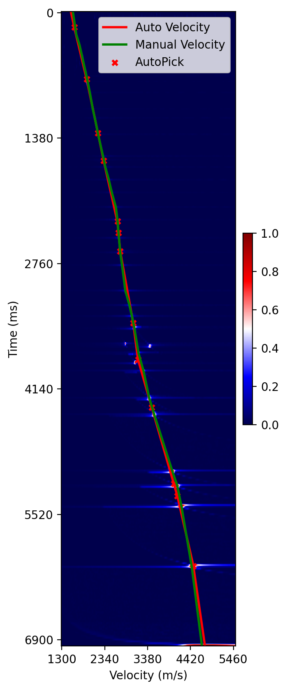
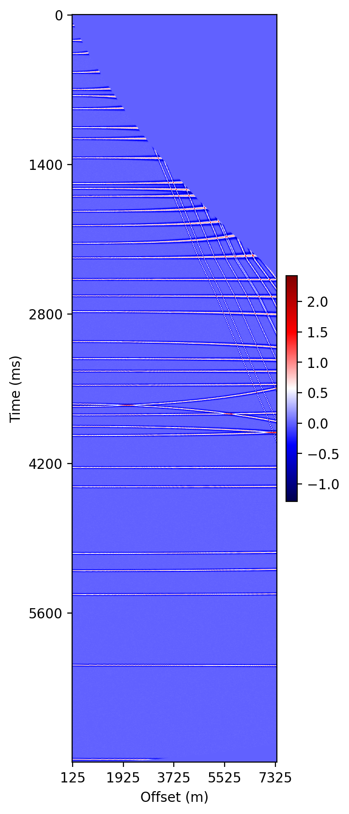

# Automatic Velocity Spectrum Picking using an Unsupervised Ensemble Learning

---
The code for the manuscript named 'Automatic Stack Velocity Picking Using an Unsupervised Ensemble Learning Method' (UEL) submitted to Computers & Geosciences.


## 0 Preparing

### Python packages

- create conda env and install python packages
```shell
conda create -n SynData python=3.8
conda list -e > requirements.txt
```

### Prepare dataset
- field dataset from your segy file
  - You need prepara two segy(sgy) files which includes velocity spectra and CMP gather infomation, and a label file which includes the velocity labels. You have to build the h5 file for the index of samples, as shown in https://github.com/newbee-ML/MIFN-Velocity-Picking/blob/master/utils/BuiltStkDataSet.py
- synthetic dataset
  - we provide a example synthetic dataset in repo: https://github.com/newbee-ML/Synthetic-Seismic-Velocity-Spectrum

After the above preparation, your dataset folder has to follow the structure:
```
-- data-root
  |-- field-set-A
    |-- segy
    |-- h5file
    |-- v_t_labels.npy
  |-- synthetic-S1
    |-- gth
    |-- pwr
    |-- ModelInfo.npy
  |-- ... 
```


## Utilize UEL to automatically pick
Using the following code to utilize UEL to pick velocity spectrum of synthetic dataset named S1 automatically.
> tips: we should first check your path setting in `data/config.py`

```shell
python UtilizeUEL.py --SetName S1 --EpName syn-S1 --TestNum 10 --VisualNum 5
```

You will obtain the following log in your shell terminal like these:
```
All xxx samples,  x are seeds
2023-02-16 15:32:02,965 - Line 2240     CDP 1440        VMAE 10.310     VMER 0.269      PR 100.000      MD 9.507        Center Num 23
2023-02-16 15:32:08,656 - Line 2240     CDP 1520        VMAE 19.359     VMER 0.679      PR 100.000      MD 18.163       Center Num 20
2023-02-16 15:32:13,597 - Line 2240     CDP 1560        VMAE 20.055     VMER 0.663      PR 100.000      MD 19.973       Center Num 13
2023-02-16 15:32:18,409 - Line 2240     CDP 1600        VMAE 26.514     VMER 0.809      PR 100.000      MD 21.533       Center Num 13
```
Also, you can check your visual results in `results/UEL/Ep-name-xxx/figs/xxx.png` like this:

- automatically picking results


- normal moveout correction by auot-picked velocity

